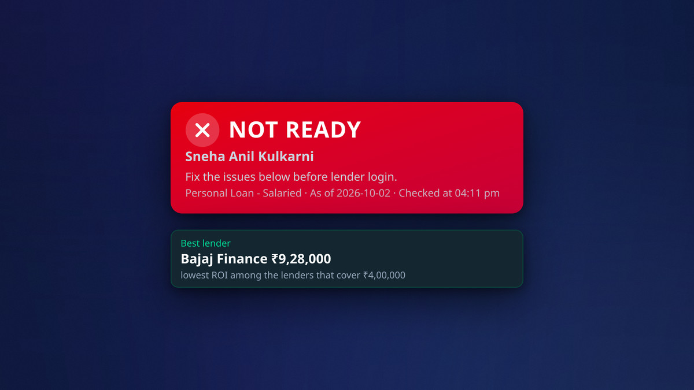
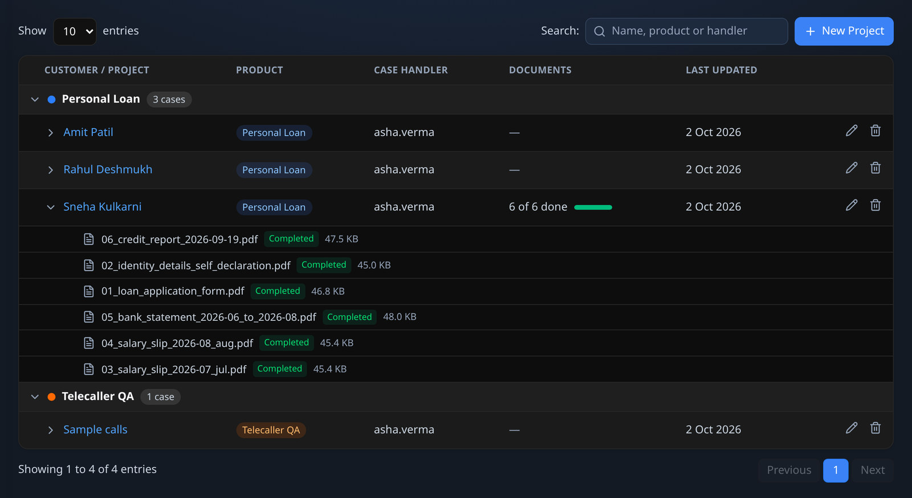
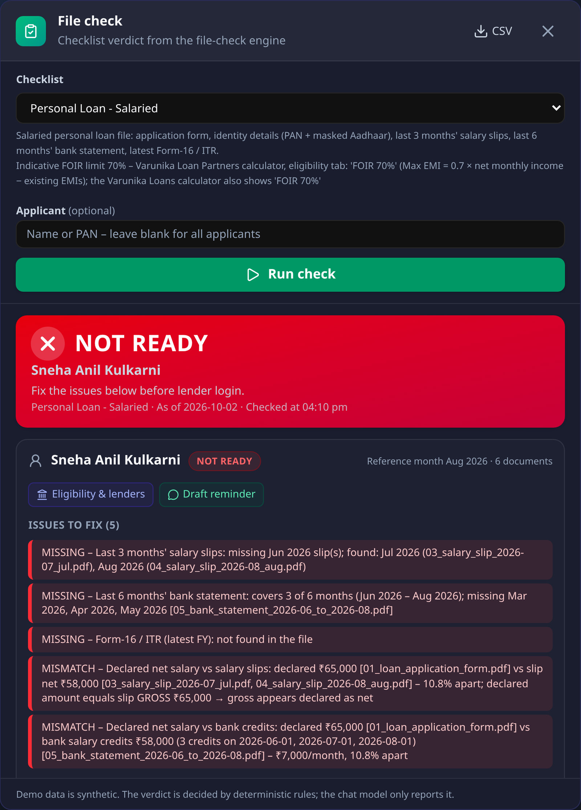
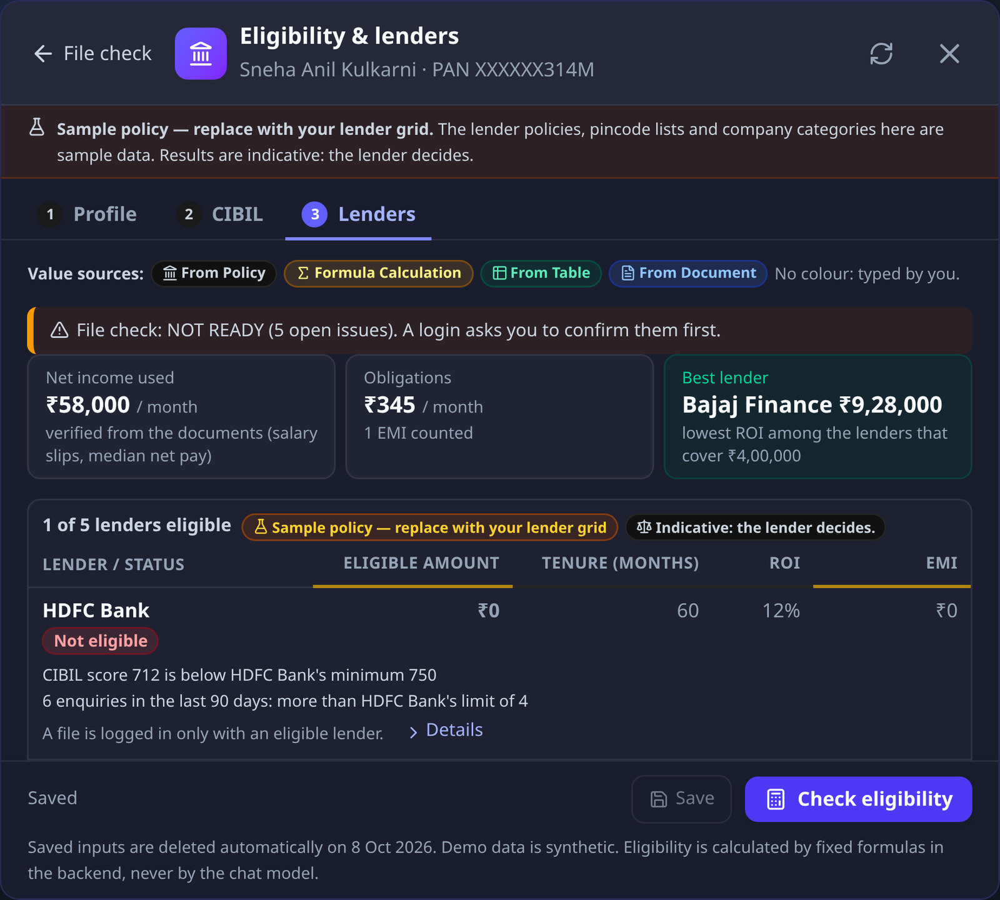
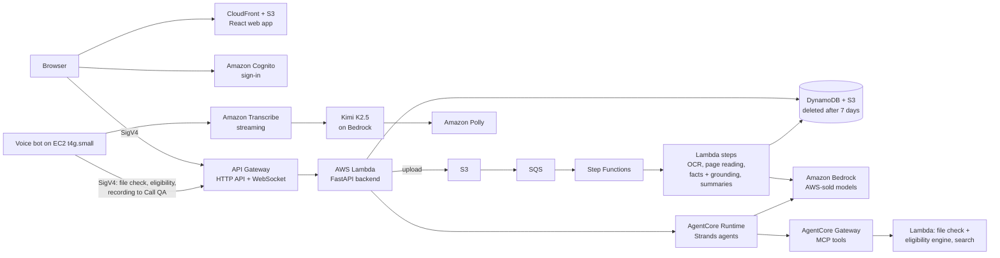
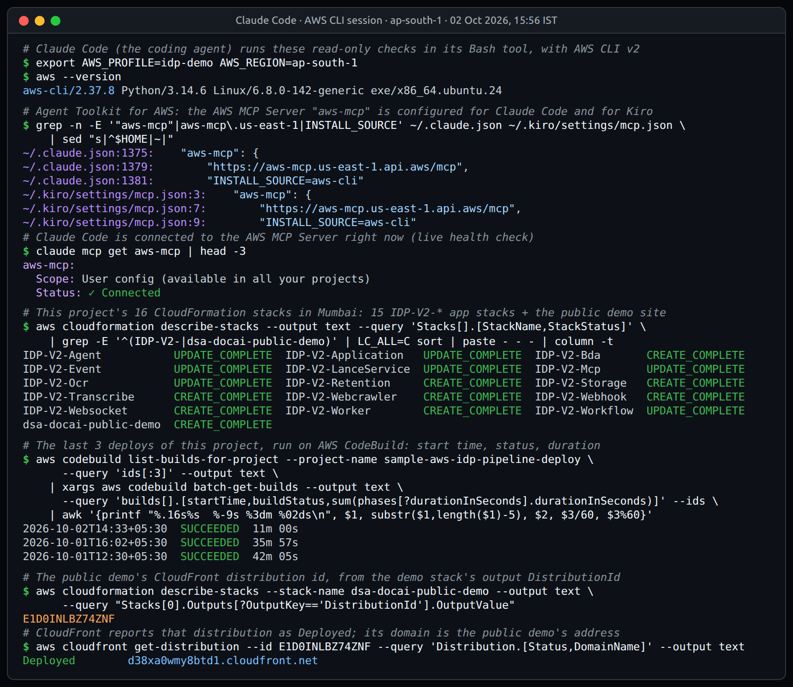

<p align="center">
  
</p>

# DSA Document AI

**Loan files checked before the lender sees them.** AI reads every page, fixed rules decide READY or NOT READY,
and the DSA's own formulas show what each lender can offer. Serverless on AWS in Mumbai (ap-south-1).

**[Live demo (no login)](https://d38xa0wmy8btd1.cloudfront.net)** ·
**[Hackathon post](https://builder.aws.com/project/3K87cYWCZ2NGKbU7qK6dQKDQ7JS/dsa-document-ai-loan-files-checked-before-the-lender-sees-them)**



Built by Prasoon Gupta for the AWS Builder Center hackathon "Zero to Shipped". The company in the demo is fictional
and every applicant, document and call is synthetic (see [Fictional company and synthetic data](#fictional-company-and-synthetic-data)).

## The problem

- In India, a large share of retail loans is sourced by **DSAs** (direct selling agents): small firms whose
  telecallers collect documents and "log in" the file with a bank or NBFC.
- Salary slips, bank statements and PAN are checked by eye, then every number is re-typed into Excel to guess
  which lender will say yes.
- A missing month, a PAN typo or a gross salary typed as net sends the file back days later, sometimes after a
  hard credit enquiry for nothing.

## What it does

- **Reads every page.** Amazon Bedrock reads the text, image and OCR of each page. Key values (PAN, salary,
  amounts) are checked against the printed text, so a misread is corrected or flagged.

  

- **READY or NOT READY.** A deterministic rules engine with per-product checklists names the exact missing months,
  PAN and name mismatches, and declared vs verified salary. No language model decides the verdict.

  

- **Eligibility per lender.** The DSA's own Excel formulas as code, with a salary-slab × company-category FOIR
  grid. It names the best lender and gives a reason for every "no".

  

- **CAM auto-fill.** The CAM fields (the **Profile** and **CIBIL** tabs) are filled from the documents with their
  sources, including the customer's own credit-report PDF.
- **Chat agents.** File Checker, Loan Assistant, Document Reminder Writer (WhatsApp and SMS drafts in English,
  Hindi and Marathi) and Call QA Reviewer, plus "Ask about this file" with the rupee cost of each answer.
- **Calls and voice.** Call QA scores recorded Hinglish calls and flags approval promises and OTP requests. An
  Indian-language voice bot ([`voice-bot/`](voice-bot)) sends its recordings to Call QA.
- **CRM webhook.** A lender login sends a signed webhook (HMAC-SHA256, headers `X-DocAI-Event`,
  `X-DocAI-Delivery`, `X-DocAI-Signature`) to the CRM.
- **Privacy.** Everything stored is deleted after 7 days; one click erases an applicant.

## Try it in 2 minutes

Open the [live demo](https://d38xa0wmy8btd1.cloudfront.net): no sign-in, read-only, with answers recorded from the
real app on synthetic data (the voice bot's microphone is off). A laptop-width window works best.

1. **File check.** Click **Sneha Kulkarni**, the green clipboard icon (**File check**) next to **Documents**, then
   **Run check**: **NOT READY**, **Issues to fix (5)**. The June 2026 slip, three months of bank statement and the
   Form-16 / ITR are missing, and she declared ₹65,000 a month against ₹58,000 on her slips and bank credits.
2. **Lenders.** Click **Eligibility & lenders**, the **Lenders** tab, then **Check eligibility**: 1 of 5 lenders
   eligible, Bajaj Finance at ₹9,28,000 on the verified ₹58,000 (the declared ₹65,000 would give ₹1,12,000 more).
   Each other lender shows its reason, such as "CIBIL score 712 is below HDFC Bank's minimum 750".
3. **Reminder.** Under **Try asking**, click **Draft a WhatsApp reminder in Marathi for the missing documents** and
   press Enter. The Document Reminder Writer runs the file check and names exactly those documents.
4. **Call QA.** Click **Projects**, **Sample calls**, then **Did the telecaller promise approval or ask for an OTP?
   List the compliance flags**, and press Enter. The telecaller said the loan would "definitely be approved":
   **H1: Promise of approval**, a **HARD FAIL** for Team Leader review.

Also open **Rahul Deshmukh** (READY) and **Amit Patil** (his application PAN differs at character 9).

## How it works



- **Web and API:** CloudFront and S3 serve the React app; Amazon Cognito handles sign-in; an API Gateway HTTP API
  (SigV4) fronts a FastAPI backend on AWS Lambda; an API Gateway WebSocket pushes live progress.
- **Document pipeline:** S3 → SQS → AWS Step Functions → Lambda steps for OCR, page reading, document facts with
  grounding against the printed text, and summaries. Amazon Transcribe handles recorded calls.
- **"AI reads, rules decide":** the model extracts; a deterministic engine
  ([`packages/lambda/file-check-mcp`](packages/lambda/file-check-mcp)) gives the verdict and the eligibility numbers,
  so the same facts always get the same verdict.
- **Agents:** Amazon Bedrock AgentCore Runtime runs the chat agents; AgentCore Gateway exposes the rules engine, the
  eligibility calculator and search as MCP tools.
- **Data:** DynamoDB with TTLs, S3 with lifecycle rules, 7-day log retention and a daily sweeper. No VPC, NAT
  gateway, always-on database or container cluster.
- **Region:** every stack and all stored data are in ap-south-1 (Mumbai). A few model calls leave the region:
  search embeddings run in us-east-1 and reranking in ap-northeast-1 (Mumbai has no Amazon embedding or rerank
  model), and Nova 2 Lite runs through Bedrock's global cross-region inference profile
  ([`region-config.ts`](packages/common/constructs/src/core/region-config.ts)). The voice bot calls its models
  in-Region only.

**Models (Amazon Bedrock, AWS-sold only):** Amazon Nova 2 Lite reads pages and answers "Ask about this file";
OpenAI gpt-oss-120b extracts document facts; Google Gemma 3 12B writes page descriptions and summaries; Amazon Nova
multimodal embeddings power search; GLM-5 (default), Nova 2 Lite and DeepSeek V3.2 power the chat; Kimi K2.5 (then
gpt-oss-120b) powers the voice bot. The roles are set in [`packages/infra/src/models.json`](packages/infra/src/models.json).

## How a coding agent built and shipped it

The coding agent was **Claude Code**, working in a terminal through the AWS CLI as a dedicated IAM user and,
since 2 October, through the **Agent Toolkit for AWS** (the AWS MCP Server plus 24 AWS skills). **Kiro** is
connected to the same server and skills.

- **Research:** read the design partner's Excel sheet, checked the RBI, DPDP Act and TRAI rules, and compared
  Bedrock models in Mumbai with live smoke tests.
- **Re-architecture:** a serverless-only deployment of the AWS sample (no VPC/NAT, Neptune, ElastiCache or
  Fargate) cut idle cost from about $7.6 a day to about $3 a month.
- **Building:** wrote the DSA features end to end with more than 2,000 automated tests, using sub-agents in
  parallel and adversarial review passes.
- **Shipping:** ran the CodeBuild deploys, chained builds past the 45-minute cap, fixed an ordering race between
  two stacks, seeded the demo data and checked every verdict live.
- **Guardrails:** credits only, Mumbai only, 7-day deletion, no secret printed, and the builder's approval before
  IAM changes, spending or anything public.

The proof: the agent's AWS CLI session with the AWS MCP Server connected, this project's 16 stacks, its last 3
deploys and the live demo's distribution.



## Repository map

| Path | What is inside |
|---|---|
| [`packages/frontend`](packages/frontend) | React web app (Vite, TanStack Router, Tailwind); `src/demo/` is the read-only public demo mode |
| [`packages/backend`](packages/backend) | FastAPI backend on Lambda: file check, eligibility, branches, CRM webhook, applicant erase |
| [`packages/lambda/file-check-mcp`](packages/lambda/file-check-mcp) | Rules engine, checklists, eligibility and loan tools (the MCP tools the agents call) |
| [`packages/lambda`](packages/lambda) | Other Lambdas: OCR, search, LanceDB service, WebSocket, MCP servers |
| [`packages/infra`](packages/infra) | AWS CDK stacks, Step Functions steps (incl. `document-facts`), built-in agent prompts, `models.json` |
| [`packages/agents`](packages/agents) | Chat agents (Strands Agents on AgentCore Runtime) |
| [`packages/common`](packages/common) | Shared CDK constructs, region settings |
| [`deploy/lean`](deploy/lean) | Deploy, update and destroy scripts for the serverless edition; cost notes |
| [`deploy/public-demo`](deploy/public-demo) | Hosting of the no-login demo: CloudFormation template, deploy and destroy scripts |
| [`voice-bot`](voice-bot) | Indian-language voice bot: Pipecat backend, web app, EC2 + CloudFront hosting |
| [`docs`](docs) | Screenshots (`docs/images`) and the AWS sample's documentation site |
| `README.upstream.md`, `LICENSE` | The AWS sample's own README and license |

## Run the tests

You need Python 3.13 with uv and Node 22 with pnpm (the voice bot: Python 3.12 and npm).

```sh
pnpm install

# backend API: 1,039 tests
cd packages/backend && uv run pytest tests/ -q

# file check, eligibility and loan tools: 213 tests
cd packages/lambda/file-check-mcp && uv run --with pytest pytest -q

# document facts (extraction, grounding, normalisation): 279 tests
cd packages/infra/src/functions/step-functions/document-facts && uv run --with pytest pytest -q

# web app: 349 tests, then the type check and the public-demo build
cd packages/frontend && pnpm vitest run && pnpm tsc --noEmit -p tsconfig.app.json
VITE_PUBLIC_DEMO=1 pnpm exec vite build

# voice bot: backend 288, web app 54, browser end-to-end 11 (see voice-bot/README.md)
cd voice-bot/backend && uv venv --python 3.12 .venv && VIRTUAL_ENV=.venv uv pip install -r requirements-dev.txt \
  && .venv/bin/python -m pytest -q
cd voice-bot/frontend && npm ci && npm test && npm run build && npm run test:e2e
```

**Total: 2,233 automated tests** (2,222 unit tests plus 11 browser end-to-end checks), counted on 2 October 2026
with `pytest --collect-only` and full test runs. The voice bot's hosting checks (`voice-bot/deploy/tests/validate.sh`)
add 70 more.

## Deploy it yourself

**The app** (`deploy/lean`). You need an AWS account, the AWS CLI v2 with admin credentials (`AWS_PROFILE` or the
default credential chain) and Amazon Bedrock access in ap-south-1 to the models in `models.json`. The build runs in
AWS CodeBuild and clones the repository from GitHub, so push your branch first.

```sh
git clone https://github.com/prasoongupta925/dsa-document-ai.git
cd dsa-document-ai

# first deploy, about 40 minutes; the admin user gets a temporary password by email
REPO_URL=https://github.com/<you>/dsa-document-ai.git ADMIN_USER_EMAIL=you@example.com deploy/lean/deploy.sh

deploy/lean/deploy.sh --admin-email you@example.com --hotswap   # code-only update
deploy/lean/update-frontend.sh                                  # web app only, about 2 minutes
deploy/lean/destroy.sh                                          # remove everything (--all: also CodeBuild and the CDK bootstrap)
```

| Setting | Meaning |
|---|---|
| `ADMIN_USER_EMAIL` / `--admin-email` | Required. The first Cognito user; its temporary password arrives by email |
| `REPO_URL` / `--repo`, `--branch` | The repository and branch CodeBuild clones (default: this repo, `main`) |
| `AWS_PROFILE` | The AWS CLI profile to deploy with; the region is ap-south-1 |
| `--stacks "..."`, `--waf`, `--no-cache`, `MAX_BUILDS` | Deploy some stacks only, turn the CloudFront WAF on, skip the build cache, allow more chained builds |

[`deploy/lean/README.md`](deploy/lean/README.md) covers the build cache, the optional WAF and accounts that stop
CodeBuild builds after 45 minutes (`deploy.sh` then chains builds on its own).

**The public demo** (`deploy/public-demo`): a static, read-only build on its own CloudFront URL, no backend.

```sh
cd packages/frontend && VITE_PUBLIC_DEMO=1 pnpm exec vite build && cd ../..
AWS_PROFILE=<profile> deploy/public-demo/deploy.sh dist/packages/frontend
AWS_PROFILE=<profile> deploy/public-demo/destroy.sh
```

See [`deploy/public-demo/README.md`](deploy/public-demo/README.md). The voice bot deploys separately:
[`voice-bot/README.md`](voice-bot/README.md).

## Cost, security and privacy

- **Cost:** about $3 a month idle, mostly two customer-managed KMS keys. About $0.013 per document measured with
  Nova 2 Lite for every step (about ₹1 of AI per document read); details in [`deploy/lean/COST.md`](deploy/lean/COST.md).
  The voice bot server costs about $0.42 a day running and about $4.7 a month stopped.
- **AWS-sold models only:** an explicit IAM Deny on the coding agent's IAM user blocks Marketplace-billed models and
  Marketplace subscriptions; the voice bot's server role carries the same kind of Deny.
- **7-day deletion:** documents, extracted facts, chat sessions, uploads and logs are deleted automatically through
  DynamoDB TTL, S3 lifecycle rules, 7-day log retention and a daily sweeper. One click erases an applicant.
- **Mumbai:** every stack and all stored data are in ap-south-1 (the model calls that leave the region are listed
  under [How it works](#how-it-works)).
- **Access:** Cognito sign-in, IAM-authorised API (SigV4), webhook secrets encrypted with a dedicated KMS key. The
  public demo has no backend at all: its content security policy allows no outside calls.

## Fictional company and synthetic data

The demo uses fictional names. **Varunika Loan Partners** is a loan DSA near Mumbai (Thane), with the consumer brand
**Varunika Loans**; it stands in for the real design partner. **CallVarta CRM** is a fictional telecalling CRM. The
handler and reviewer personas (Asha Verma, Rohan Iyer), the applicants (Sneha Kulkarni, Rahul Deshmukh, Amit Patil),
their documents and the Hinglish call are made up; the call is voiced with Amazon Polly. Lender names appear only in
SAMPLE policy and branch data: nothing here is a lender's real policy, and no lender has reviewed it.

Reference data: the India Post pincode directory (Government Open Data License - India) and the RBI bank branch list
via [razorpay/ifsc](https://github.com/razorpay/ifsc) (public domain); see
[`packages/backend/app/data/branches/README.md`](packages/backend/app/data/branches/README.md).

## Built on, credits and license

- **[sample-aws-idp-pipeline](https://github.com/aws-samples/sample-aws-idp-pipeline)** (aws-samples, Amazon
  Software License): the document-processing foundation (upload, OCR, page analysis, search, chat and agents on
  AgentCore). This repository keeps the sample's [LICENSE](LICENSE), which allows use only with services provided
  by Amazon Web Services, and its README as [README.upstream.md](README.upstream.md).
- **The AWS sample for a real-time multilingual Indic voice assistant** (Pipecat, MIT No Attribution): the voice
  bot's starting point; its license is in [`voice-bot/LICENSE`](voice-bot/LICENSE).
- Everything DSA-specific was built for this project: the serverless lean deployment, the rules and eligibility
  engines, CAM auto-fill, the checklists and agents, the webhook, call QA, the voice bot's tools and hosting, the
  guardrails and the demo data.

Not legal or credit advice, and not a compliance claim.

**Built by Prasoon Gupta.**
