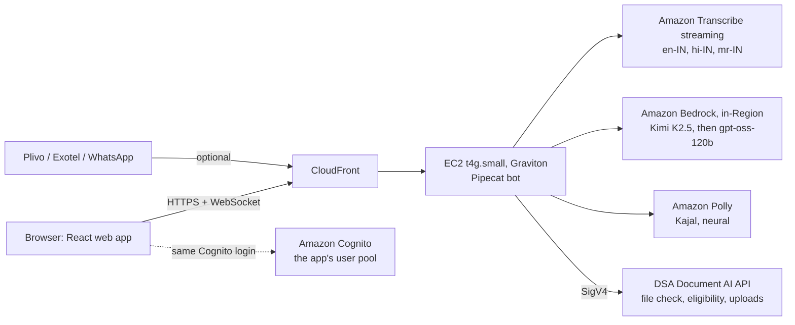

# DSA Document AI – Voice bot

An Indian-language voice assistant for a loan DSA's telecallers and customers. You talk to it in English, Hindi
(also Hinglish) or Marathi from a browser, a phone line or WhatsApp. It looks up the loan file in
[DSA Document AI](../README.md) and answers aloud: which documents are still missing, the indicative eligibility,
and the WhatsApp/SMS reminder text. Every call's recording goes to the app's Call QA project for review.

The demo persona speaks for the fictional DSA **Varunika Loan Partners** ("Varunika Loans"). All data is synthetic.

## What it does

- **Says what it is.** Every call starts with "I am an AI assistant, and this call is recorded".
- **Uses four tools** on the app's API (SigV4, read-mostly) in `backend/tools.py`:
  - `file_status`: runs the file check (READY / NOT READY, missing documents);
  - `eligibility`: the indicative amount per lender, from the app's eligibility engine;
  - `reminder`: the WhatsApp or SMS reminder text for the missing documents;
  - `verify_caller`: checks a phone or WhatsApp caller (caller ID or date of birth) before it shares anything.
- **Never promises approval** and never asks for an OTP. The system prompt is in `backend/prompt.py`.
- **Sends the recording to Call QA.** After the call, the stereo recording is uploaded to the app's
  "Telecaller QA – Sample calls" project, where the app transcribes and reviews it. The server keeps no copy.
- **Masks personal data in logs**: PAN, Aadhaar, phone numbers, e-mails and tokens.

## Architecture



- **Everything in ap-south-1 (Mumbai)**, including every model call: the server role denies inference profiles
  (`global.`, `apac.`, `in.`), every other Region and Marketplace-billed models.
- **One small server**: an EC2 `t4g.small` behind CloudFront, started for demos and stopped otherwise
  (about $0.42 a day running, about $4.7 a month stopped; see [deploy/README.md](deploy/README.md#cost)).
- **Same login as the app**: the voice web app has its own client in the app's Cognito user pool.
- **Pipeline**: [Pipecat](https://github.com/pipecat-ai/pipecat) with Silero VAD, Transcribe streaming (STT),
  Bedrock (LLM) and Polly (TTS); barge-in is supported.

| Folder | What is inside |
|---|---|
| `backend/` | The bot: FastAPI + Pipecat (`main.py`, `bot.py`), tools, prompt, Cognito auth, phone and WhatsApp routes, tests |
| `frontend/` | The web app (React, Vite): sign-in, language picker, call screen with captions and result cards |
| `deploy/` | The hosting: CloudFormation template, deploy / update / start / stop / destroy scripts, the server runner, tests |
| `infra/` | The original AWS sample's CDK stack (Fargate, load balancer). Not used by this hosting; kept for reference |

## Run the tests

```sh
# backend (Python 3.12): 288 tests
cd voice-bot/backend
uv venv --python 3.12 .venv && VIRTUAL_ENV=.venv uv pip install -r requirements-dev.txt
.venv/bin/python -m pytest -q

# web app (Node 22): 54 unit tests, then 11 browser end-to-end checks (needs Chrome or Chromium)
cd ../frontend
npm ci && npm test
npm run build && npm run test:e2e

# hosting: scripts, template, server runner and release script (--offline: no AWS calls)
cd .. && bash deploy/tests/validate.sh --offline
```

## Run it

**Locally** (needs AWS credentials for ap-south-1 and a deployed DSA Document AI):

```sh
cd voice-bot/backend
cp .env.example .env        # fill in COGNITO_USER_POOL_ID, COGNITO_APP_CLIENT_IDS and IDP_API_URL
.venv/bin/python main.py    # http://localhost:8080
cd ../frontend
cp public/config.example.json public/config.json   # region, userPoolId, userPoolClientId, websocketUrl
npm run dev
```

The settings are documented in [backend/.env.example](backend/.env.example) and
[frontend/README.md](frontend/README.md). Never commit `.env` or `config.json`.

**On AWS** (one EC2 server behind CloudFront, in Mumbai):

```sh
cd voice-bot
AWS_PROFILE=<profile> deploy/deploy.sh    # first deploy, about 12 minutes; prints the URL
deploy/status.sh                          # URL, server state, release
deploy/stop.sh                            # pause between demos
deploy/start.sh                           # resume before a demo
deploy/destroy.sh                         # remove everything
```

[deploy/README.md](deploy/README.md) covers what the stack creates, the least-privilege server role, the phone and
WhatsApp channels (off until their keys are set), costs and limits.

## Credits and license

Started from the AWS sample for a real-time multilingual Indic voice assistant (Pipecat, MIT No Attribution); see
[LICENSE](LICENSE), [THIRD-PARTY-LICENSES](THIRD-PARTY-LICENSES) and [CHANGELOG.md](CHANGELOG.md). This copy replaces
the sample's third-party speech services and knowledge base with Amazon Transcribe, Amazon Bedrock and Amazon Polly
in Mumbai, and adds the loan-file tools, the Call QA upload, the phone and WhatsApp channels and the EC2 hosting.

Built by Prasoon Gupta.
